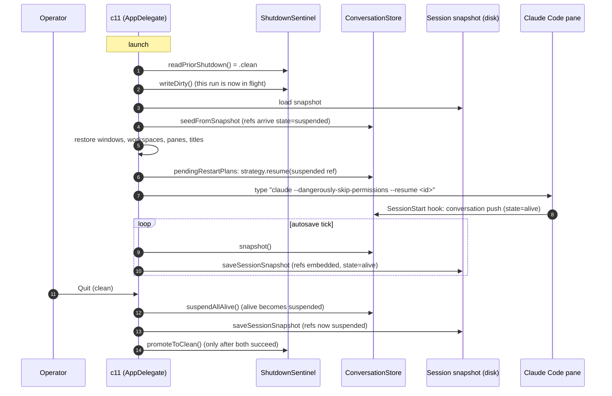
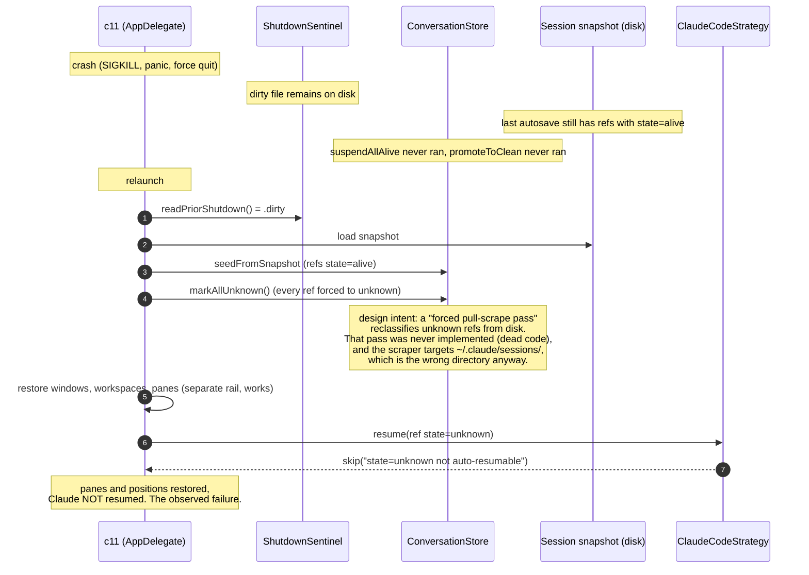
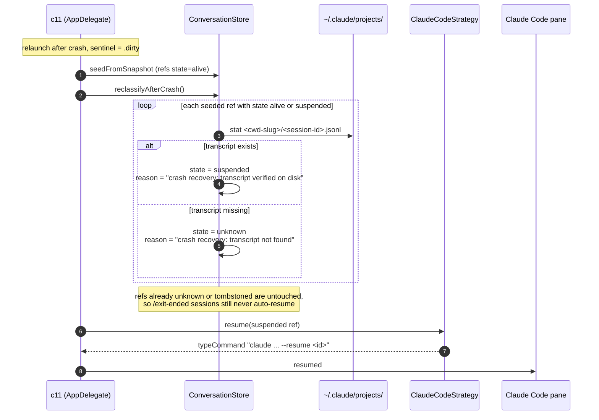
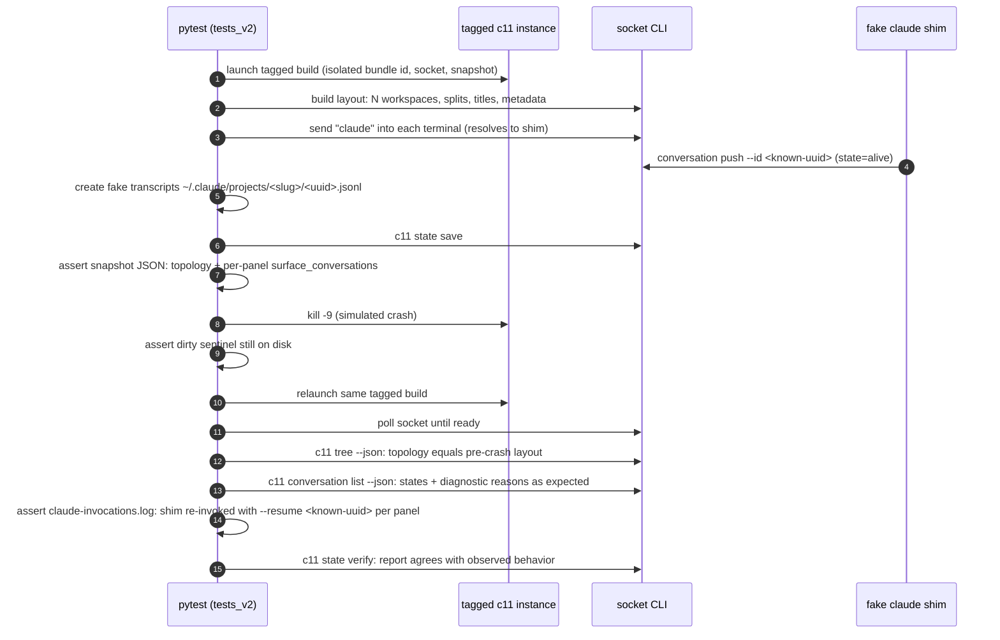

# c11 state save/load and crash resume

Design note covering three connected pieces:

1. How session persistence and conversation resume actually work today, as sequence diagrams (clean shutdown vs crash).
2. A CLI surface for explicit state save and state load, including the "c11 is getting laggy, give me a clean restart" use case.
3. A programmatic test plan that validates save, crash, relaunch, and full workspace + conversation resume end to end.

Grounding: `Sources/Conversation/` (store, strategies, sentinel), `Sources/AppDelegate.swift` (launch and terminate choreography), `Sources/Workspace.swift` (snapshot capture and `pendingRestartPlans`), `Sources/TerminalController.swift` (socket verbs, including the existing DEBUG-only `debug.session.save_and_load`).

---

## 1. Lifecycle today

### 1a. Clean lifecycle: the path that works

Key invariant: `suspended` is the only state the resume strategy will act on besides `alive`, and `suspended` is only ever written by the clean-quit path.

### 1b. Crash lifecycle: the path that fails today

### 1c. Crash lifecycle after the fix: verify, then resume

The blanket `markAllUnknown` is replaced by a reclassification pass that verifies each ref against the transcript Claude Code already keeps on disk at `~/.claude/projects/<cwd-slug>/<session-id>.jsonl` (stat only, transcript bytes are never opened, preserving the privacy contract).

---

## 2. Explicit state save / load CLI

Motivating scenario: c11 is getting laggy after a long run. The operator wants to checkpoint everything, restart the app, and land back exactly where they were, with every Claude conversation resumed. Today the only way to get that is a clean Quit from the menu and a manual relaunch.

### Proposed verbs

#### `c11 state save [--out <path>] [--scrollback]`

Forces the same full-app `saveSessionSnapshot` that autosave and terminate use, synchronously, while the app keeps running.

- New socket verb `session.save` (production cousin of the existing DEBUG-only `debug.session.save_and_load`).
- Does not touch the sentinel and does not suspend refs. The app is still live; refs stay `alive`.
- Returns the snapshot path plus counts: windows, workspaces, terminal panels, embedded conversation refs.
- Default target is the canonical per-bundle path (`~/Library/Application Support/c11/session-<bundle-id>.json`); `--out` writes an additional copy for archival or test fixtures.

#### `c11 state verify [<path>]`

Read-only dry run of the resume decision. Parses the snapshot and reports, per terminal panel: conversation kind, session id, persisted state, transcript-on-disk check, and the exact `ResumeAction` the strategy would produce.

- Needs no running app for the parse + disk checks, so it doubles as the test oracle and a post-crash diagnostic ("why didn't pane X resume?").
- Exit code 0 when every panel that has a ref would resume; non-zero with a per-panel report otherwise.

#### `c11 app restart [--no-resume]`

The laggy-c11 command. Runs the full clean-shutdown choreography (suspendAllAlive, final snapshot, promoteToClean), relaunches the app, and lets the normal restore path bring back every workspace and resume every conversation.

- This is deliberately the primitive instead of "load state into the running instance": tearing down and rebuilding live PTYs, Ghostty surfaces, and browser processes inside a running app is a much bigger blast radius than a scripted clean bounce, and the end state is identical.
- `--no-resume` restores layout but skips conversation resume (types nothing into panes).

#### `c11 state load <path>` (phase 2, deliberately deferred)

Applying an arbitrary saved snapshot into a running instance raises replace-vs-merge semantics, id collisions with live surfaces, and double-resume hazards. Workspace-scoped restore already exists (`c11 snapshot` / `c11 restore`), and the full-app case is covered by `app restart`. Defer until a concrete need shows up.

### Why this shape

- `state save` is cheap insurance the operator (or a cron, or an agent noticing lag) can fire anytime. It also gives tests a deterministic "checkpoint now" hook instead of waiting for the autosave tick.
- `state verify` makes the resume pipeline observable without side effects. Most of the cost of this bug class is that the decision (`skip: state=unknown`) was invisible until someone read DEBUG logs.
- `app restart` matches what the operator actually wants when things get slow, and it exercises exactly the clean path in diagram 1a, so heavy use of it continuously validates the persistence rail.

---

## 3. Programmatic test plan: save, crash, relaunch, validate

Three tiers, matching the repo's existing testing policy.

### Tier 1: logic tests (`c11LogicTests`, safe to run locally)

Pure model coverage, no app host:

- **Sentinel:** dirty written at launch removes stale clean; promoteToClean prefers clean when both exist; missing dir reads as crash.
- **Store transitions:** suspendAllAlive only touches alive; reclassifyAfterCrash promotes verified refs to suspended and demotes unverified to unknown; tombstoned and unknown refs are untouched; diagnostic reasons are set exactly.
- **Strategy matrix:** resume(alive) and resume(suspended) produce `typeCommand` with correct quoting; resume(unknown), resume(tombstoned), placeholder, and bad-UUID all skip with stable reasons.
- **Snapshot round-trip:** `surface_conversations` encode/decode preserves state, capturedVia, cwd; legacy `claude.session_id` lift still works for the bridge window.
- **Transcript check seam:** the verify pass takes an injectable filesystem (the `ConversationFilesystem` protocol already exists for the scraper); fixture layouts cover present, missing, and malformed-slug cases.

### Tier 2: full save/crash/relaunch loop (python, `tests_v2/`, tagged build)

This is the test the feature exists for. Tagged builds already have distinct bundle ids, which isolates their snapshot file, sentinel files, and socket path from the operator's production c11 for free.

**The key trick: a fake `claude` shim.** A script placed ahead of the real binary on PATH inside the test instance's terminals. It records its argv to `/tmp/<run>/claude-invocations.log`, performs the same `c11 conversation push --kind claude-code --id <uuid>` a real SessionStart hook would, then blocks like a TUI. Pair it with pre-created fake transcript files at the path the verify pass checks. Result: the entire capture-persist-crash-verify-resume pipeline runs with zero dependency on a real Claude login, fully deterministic ids, and a machine-readable record of exactly what got resumed with which flags.

**Scenario variants, same harness:**

| Scenario | Setup | Expected |
|---|---|---|
| Clean restart | `c11 app restart` instead of kill -9 | clean sentinel, refs suspended in snapshot, all panels resume |
| Crash, transcript present | kill -9, fake transcripts exist | all panels resume with `--resume <id>` (the fix's acceptance test; fails red on today's HEAD) |
| Crash, transcript missing | kill -9, delete one fake transcript | that panel skips with "transcript not found", others resume |
| /exit before crash | shim pushes tombstone (SessionEnd) | panel restores as fresh shell, never resumes |
| Double crash | kill -9 twice without clean quit between | idempotent: second relaunch behaves like the first |
| Kill switch | `CMUX_DISABLE_CONVERSATION_STORE=1` | layout restores, no resume attempts, no errors |
| Non-claude panel | plain zsh pane, no shim | restored, untouched by resume rail |

**Oracle note:** the decisive assertion is the shim's invocation log, not screen text. `read-screen` scraping of prompts is explicitly banned by the skill and CLAUDE.md; argv capture in the shim is exact and stable.

### Tier 3: CI

Wire the Tier 2 scenario set into `test-e2e.yml` as a job (`gh workflow run test-e2e.yml`, never local). Tier 1 already rides the existing `build` gate via the `c11-logic` scheme.

---

## 4. Suggested ticket breakdown

1. **Crash-resume fix** (the bug): `reclassifyAfterCrash` verify pass replacing `markAllUnknown`, strategy seam for per-kind verification, scraper path corrected or deleted, Tier 1 tests. This stands alone and fixes the observed failure.
2. **`c11 state save` + `state verify`**: socket verb `session.save`, CLI plumbing, verify report. Unblocks the Tier 2 harness.
3. **`c11 app restart`**: clean-bounce choreography + relaunch.
4. **Tier 2 harness + scenarios in `tests_v2/`**, then the CI job.

Order matters: 2 before 4 (the harness wants `state save` as its checkpoint hook), and 1's acceptance test is the "crash, transcript present" row, which lands red-then-green inside 4 if built together, or as a focused Tier 1 + manual tagged-build validation if 1 ships first.
